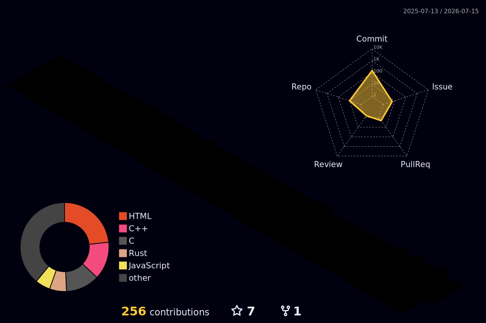

# Dominic Kolp

https://domkolp.qzz.io

I program low-level projects. I was inspired to start programming because at the ripe
old age of 7, because I learned that it was necessary for making Sonic fan games.

In my free time, I listen to music and program stuff.

## Info

Where to find me:

* contact@domkolp.qzz.io
* [YT](https://youtube.com/@stupid-dev)
* [Discord](https://discord.com/users/1246426621641101363)

What I work on:
* Low-level projects (mainly CLI or graphics)
* Python Projects (mainly games / game tools)
* Open-Source Projects

